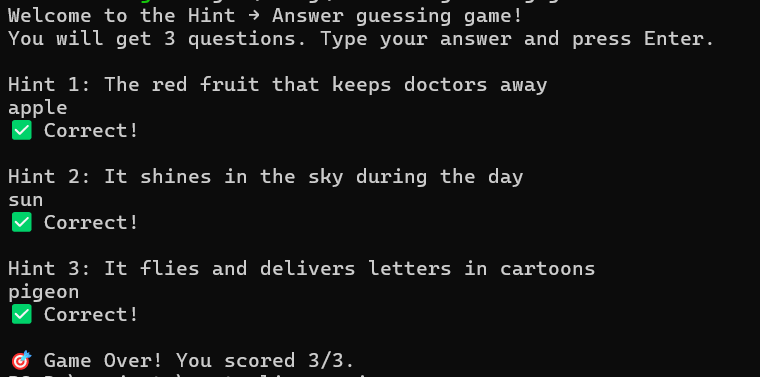
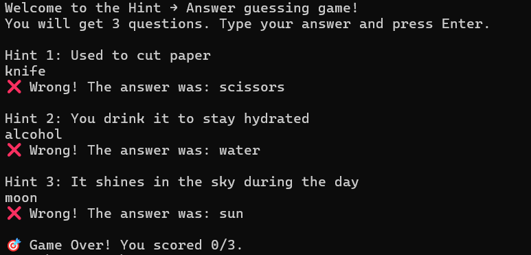

# Hint → Answer CLI Game

A simple command-line guessing game written in Rust. Players are shown a general hint and must guess the correct word.

## Features

- Randomly selected questions from a list
- Score tracking
- Simple CLI interface

## Screenshot



## How to Run

1. Clone the repository:
   ```bash
   git clone https://github.com/levanter914/rust-cli-guessing-game.git
   cd rust-cli-guessing-game
    ```

2. Run the game using Cargo:

   ```bash
   cargo run
   ```


